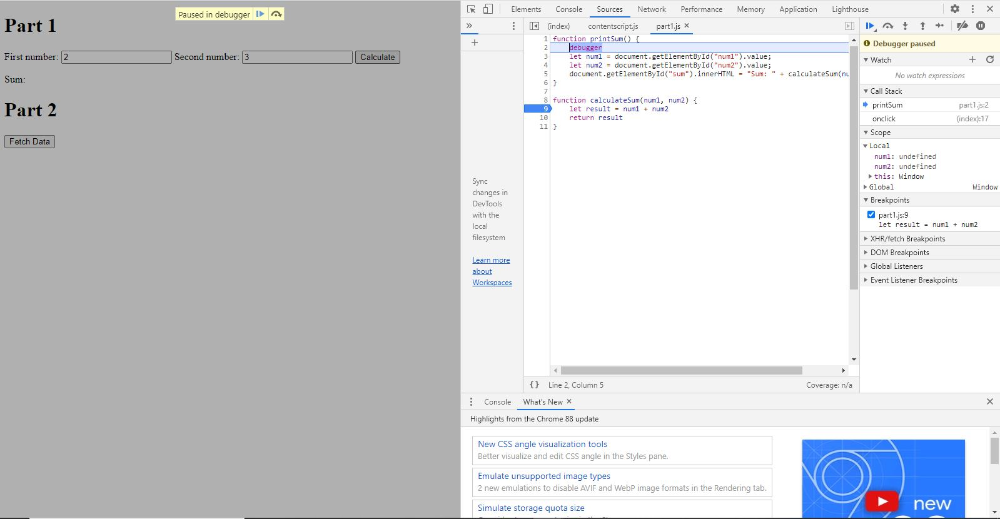
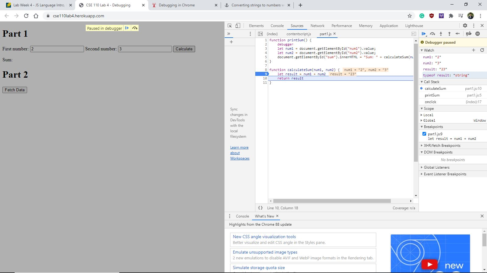

### What was the bug?

The bug was that the function was taking num1 and num2 as string variables. This means that
the input was strings, so num1 and num2 are concatenated instead of added.

### How would you fix it? Include screenshot of your fix.

I would fix this by adding the Number(num1) and Number(num2), this would change the string values to integers/numerical values
so the + symbol will be seen as addition.

